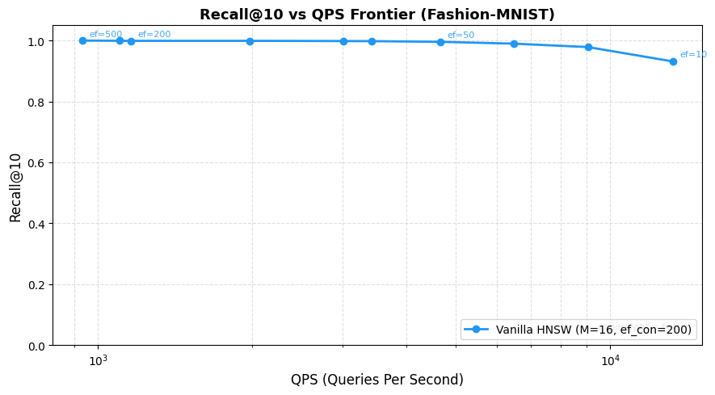
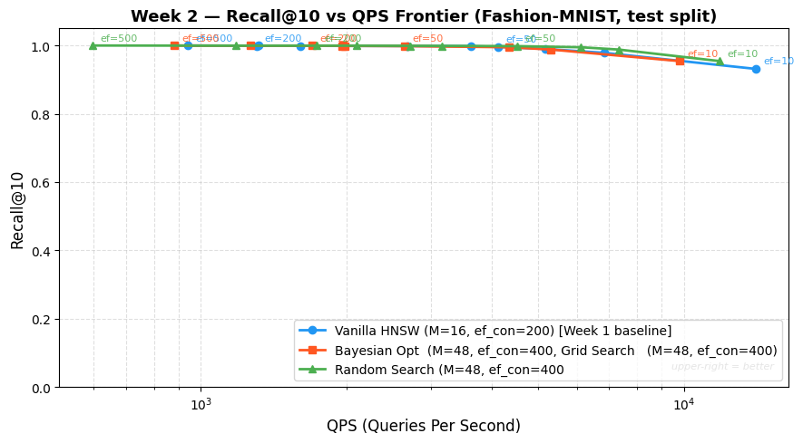
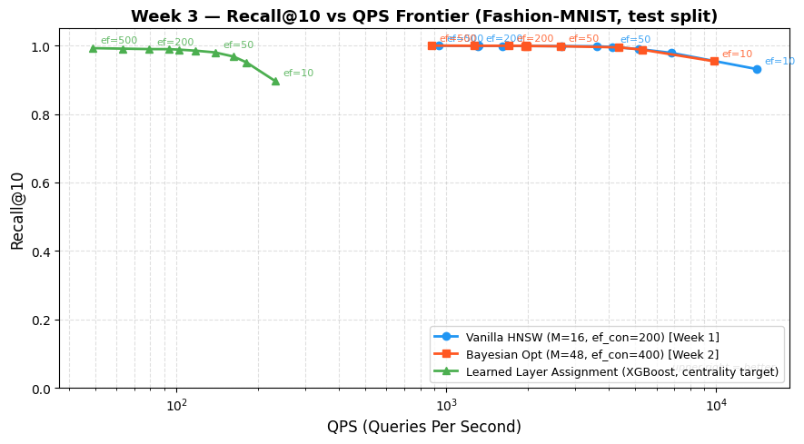
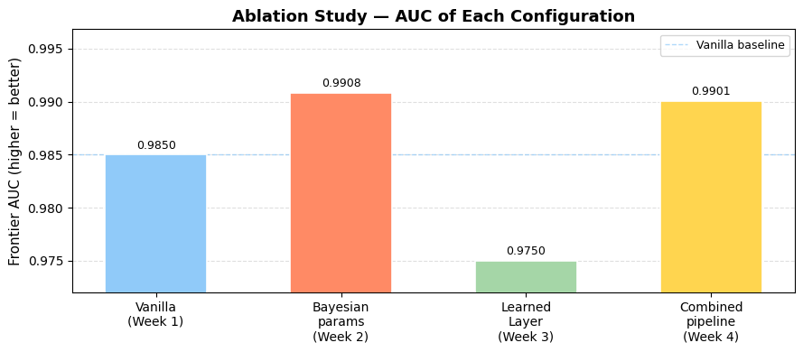
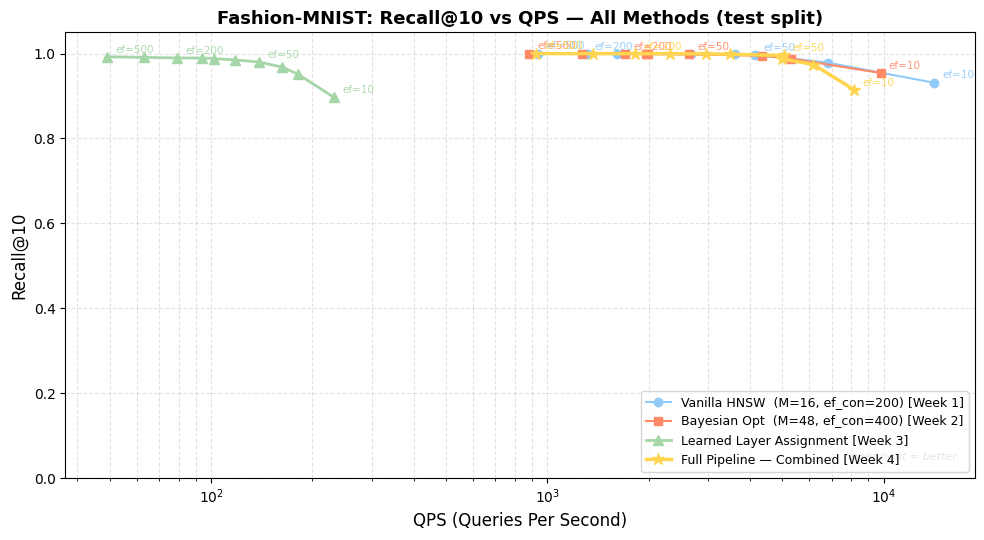
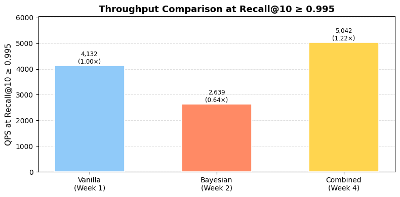

# Results Gallery

All plots are generated directly by the notebooks in `/notebooks` — nothing here is hand-edited.

### 1. Vanilla HNSW baseline

Recall@10 vs. QPS frontier for default HNSW (`M=16, ef_construction=200`) across `ef_search ∈ {10...500}`. This is the reference curve every learned method is compared against.

### 2. Global parameter search: Bayesian vs. Grid vs. Random

All three search strategies land on `M=48, ef_construction=400`, each pushing the frontier up and to the right of vanilla. Random and grid search edge out Bayesian optimization on AUC in this particular (small, discrete) 25-config search space.

### 3. Learned layer assignment

XGBoost-driven layer assignment vs. the Bayesian-optimized baseline. The learned variant underperforms — see the root README for the investigation into why (density is a poor proxy for inter-cluster bridging).

### 4. Ablation: which component contributes what

AUC gain/loss relative to the vanilla baseline, isolating the contribution of each learned component.

### 5. Master frontier — all methods overlaid

Every method on one plot: vanilla, Bayesian-optimized, learned layer assignment, and the combined hub-first pipeline.

### 6. Throughput at a fixed recall target

QPS achieved by each method at a fixed Recall@10 = 0.995 target — a more deployment-relevant comparison than raw AUC.
